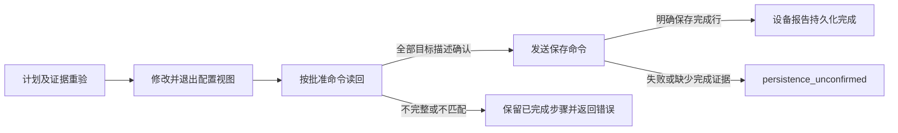

# 设备操作架构

一个连接器对应一台设备的一段会话。`Base` 组合设备能力，提供统一的命令执行和会话入口；各项能力的公开方法、流程和策略放在同一功能目录。公共层不反向依赖厂商，也不保留另一套 Operations 入口。

| 层次 | 职责 | 位置 |
| --- | --- | --- |
| 会话引擎 | 登录、传输、命令、脚本及资源所有权 | `engine/` |
| 日志 | 事件上下文与生命周期；安全事件、格式和字节流分别实现 | `engine/log.rb`、`engine/log/` |
| 设备入口 | 能力组合、会话代理、通用脚本钩子 | `device/base.rb` |
| 设备档案 | 不可变规则与策略接口校验；Builder 负责声明 DSL | `device/profile.rb`、`device/profile/` |
| 配置采集与保存 | 采集策略生命周期、完整性校验、显式保存 | `device/running_config.rb`、`device/running_config/`、`device/save_config.rb` |
| 本地备份 | 采集、摘要比较、文件持久化和完成回执 | `device/local_backup.rb` |
| TFTP | 参数预检、上传、完成证据、目标和回执 | `device/tftp.rb`、`device/tftp/` |
| 拓扑 | 邻居发现、接口名称/描述、变更计划与分阶段执行 | `device/topology.rb`、`device/topology/` |
| 厂商差异 | 档案组装及各项能力的厂商策略 | `vendor/<厂商>.rb`、`vendor/<厂商>/` |
| 文件存储 | 路径锁、安全读取、私有原子写入、离线配置 | `storage.rb`、`storage/` |
| 解析 | TextFSM 模板选择、记录转换及异常映射 | `textfsm.rb`、`templates/` |
| 终端文本 | 严格 UTF-8 字节验证和终端渲染 | `engine/terminal_text.rb`、`engine/terminal_renderer.rb` |
| 清单与批量编排 | 清单预算、策略快照、计划校验、工作线程和报告 | `netdisco/` |

`Base` 引入 `RunningConfig::Capability`、`LocalBackup::Capability`、`Tftp::Capability`、`Topology::Capability`、`TextFSM::Capability` 及 `SaveConfig`。能力入口与实现共置，Base 不再重复业务包装。配置采集的临时策略绑定也由 RunningConfig 管理；备份与拓扑通过 `device.running_config` 复用同一流程。

## 公开业务方法与确认范围

下表区分执行结果、业务产物和直接抛出的前置错误；调用方不能假设所有失败都在
`result.error`。参数/脚本预检失败不代表产生过 Result，`Result#value!` 则会重新抛出
其中的领域错误。错误诊断已脱敏，返回的原始输出、配置和文件内容仍是敏感业务数据。

| 入口 | 正常返回 | 失败和前置约束 |
| --- | --- | --- |
| `execute_command`、`execute_script` | `Result`，`steps` 保留完整已完成响应 | 参数/脚本构造错误可直接抛出；执行、钩子和预算错误通常进入 Result，不自动重放 |
| `running_config` | `Result`，`config` 为通过完整性检查的清理副本 | 执行或清理失败保留步骤；自定义档案/策略构造错误仍可能直接抛出 |
| `save_config` | `Result` | 不支持时为失败 Result；该入口确认命令响应，不提供拓扑读回或设备介质验证 |
| `backup(path:)` | `Backup`，含 path、bytes、sha256、collected_at、change、previous_sha256 | 采集/文件错误直接抛出；已 rename 后的持久性错误携带完成回执，不能视为未写入 |
| `tftp_backup` | `TftpReceipt`，直接包含 server、path、时间、来源、格式及核验等级 | 参数先校验；失败/未确认直接抛出。完成后故障为 `TftpCompletionError`，保留回执 |
| `parse_command`、`parse_config` | TextFSM 记录数组 | 命令失败、模板错误、严格 UTF-8/解析错误直接抛出，不用空数组代替未知输出 |
| `neighbors`、`interface_descriptions` | `Neighbor` 数组、接口到描述的 Hash | 不支持、未知/部分输出或读取失败直接抛出；明确空表才允许空结果 |
| `plan_interface_descriptions` | 冻结的 `Topology::Plan` | 只读证据和能力检查；PAN-OS 当前拒绝自动改写计划，无隐式 commit |
| `apply_interface_descriptions(plan, confirmed:)` | `Result`，包括变更后已完成的读回/保存步骤 | 未确认、错误设备/旧命令序列、能力不足及重验失败在写入前直接抛出；`stale_plan` 是 `DeviceError`。开始变更后的领域失败保留步骤 |
| `SavedConfig#read/#parse/#export` | 原始字节、记录数组；export 返回目标路径或 stdout 模式的 nil | 纯本地，只读取规范地址文件；缺失、不安全文件、解析或写入错误直接抛出 |
| `Fleet#backup_all/#tftp_backup_all` | 统一 `Report`，内部包含原始执行快照 `Batch` | 设置、外部计划和清单错误在派发前抛出；设备/关闭/回调/报告普通故障保留在批次中，线程中断仍清理后传播 |

确认分为三个独立层次：

1. 命令响应完成：匹配本次响应的结束提示，或收到厂商明确完成行；不等于业务状态正确。
2. 业务状态读回：目标描述与批准计划一致；不排除其他设备会话此后改写，也不等于已持久化。
3. 持久化/服务端证据：本地文件完成 fsync/rename/目录 fsync，或设备明确报告保存完成。
   TFTP 目前只有设备报告，不能据此证明服务器文件、SHA-256 或本批版本归属；设备保存
   完成行也不是断电测试。读取、核验、持久化任何阶段失败都不触发自动回放/回滚。

## 业务约束

连接器独占一个会话。`Session` 串行执行登录和脚本，失败时关闭传输，不自动重放设备命令。`Result` 在后续步骤失败时仍保存已完成步骤。`RunningConfig` 每次采集创建一个新策略，同一策略负责响应检查、结果选择和清理。选择与清理在会话锁内经过现有设备钩子，子类覆盖后可调用 `super`。清理失败时也会解除临时绑定，其他 Fiber 的离线清理不能借用该策略。

采集命令匹配当前会话的完整提示符行，不以末尾单个 `#`、`>` 或 `]` 判断完成。PAN-OS 切换视图时保留已认证的设备身份。缺少最终提示符会使采集失败，旧备份保持不变；只有提示符或命令回显的响应属于 `:incomplete_configuration`，不是成功的空配置。PAN-OS 在 `show` 前后都检查候选配置差异。

`LocalBackup` 在采集前取得 `BackupLock`，持有到摘要比较、替换与结果构造结束。锁名由 realpath 父目录与归一化文件名决定；Unicode NFC、大小写折叠后的摘要同时覆盖尚未创建的目标。区分大小写的文件系统也保守合并这些锁，目标名称本身不变。锁文件用 NOFOLLOW/0600 打开，再验证普通文件、所有者、单硬链接和 inode；释放仅关闭 FD，不删除锁文件。默认 `flock(LOCK_EX | LOCK_NB)`，可选等待共用有限单调期限，超时均为 `BackupBusy`。

Fleet 在规范目标校验、凭据解析及连接器构造之前加同一把锁，再向下层备份授权一次同进程、同 Fiber 的借用。借用在采集前消费，回调递归备份不能重复使用；没有全局路径缓存。路径锁在外、会话锁在内，`Base#backup` 拒绝已有会话操作中的嵌套调用。独立进程必须采用同一 flock 协议；调用方保护目录及祖先，锁不约束不合作的写入者。

`SafeFile` 对一次 NOFOLLOW/NONBLOCK 打开的 FD 做 fstat 和读取，拒绝非普通文件。`SavedConfig#read/#fingerprint`、离线导出和解析复用该边界；`find` 返回当时已验证的路径，不保证调用方日后重新打开时身份不变。直接备份继续安全替换末级符号链接，Fleet/SavedConfig 则保留拒绝契约。内容不变时再核对目录项身份，避免因路径替换跳过必要写入；正常未变文件保持 mtime。

`Storage::PrivateFile.write` 统一返回 `Receipt`，执行临时文件写入、flush/fsync、rename、父目录 fsync，并跟踪 not_committed/committed/durable 和出错阶段。rename 前失败保留旧文件；之后失败保留新文件。目录 fsync 的 EINVAL/ENOSYS/ENOTSUP/EOPNOTSUPP/NotImplementedError 单独表示不支持；其他错误不能降级为成功。durable 只表示同步调用成功，未变内容不补验过去写入，断电恢复也未在本地测试中验证。

提交后的 `BackupPersistenceError` 只携带原 `Backup` 元数据和受控写入回执，Fleet 保留产物并使用已有 saved_with_error 分类。只接受库定义的具体完成错误及匹配产物类型，第三方异常的 backup 属性或自定义 WriteError 子类不作为完成证据。报告保留已提交位置，导出错误说明 committed；设备命令不会自动重放。

TFTP 只确认设备报告的上传结果：策略去掉命令、应答和提示符回显后，检查明确的完成行；文件名或表示“即将上传”的进度文字不算成功。原始输出或终端渲染文本中的失败证据优先于成功文字。

TFTP 内置策略的 `validate_options!` 是纯参数校验，执行于 H3C 源文件探测之前。整个探测、脚本、证据核对、回执和事件记录由原有 `with_operation(:tftp_backup)` 独占；其他线程、Fiber 及回调重入均不能插入设备命令。租约只保护当前会话，不能隔离其他设备连接或服务器上的同名文件。

`tftp_backup` 只返回不可变 `TftpReceipt`，直接包含来源、格式、请求路径和实际 `path`、完成时间及核验等级。只有设备完成证据时为 device_reported，没有服务器 SHA-256。H3C 自动源探测为 startup，显式文件为 saved_file/unknown；山石为 startup/dat，Cisco 为 running/cfg，PAN-OS 为 running/xml，Radware 为 native_archive/tgz。公共策略的默认来源为 unknown，不能据扩展名或字节数推断服务器内容。

明确完成证据先生成最小回执，再执行路径提取、元数据钩子及事件记录。已完成步骤之后的清理错误同样保留回执；路径不可用时保留 nil，不把请求文件名冒充实际目标。`TftpCompletionError` 只含受控码、类型和回执，不带原始消息、输出或 cause。Fleet 仅信任库定义的精确错误类及匹配产物；第三方异常上的 receipt 字段和错误子类不能供应完成事实。已上传但收尾失败使用 reported_with_error/partial 分类。

`Topology` 读取邻居和旧描述，冻结计划，要求显式确认，并在写入前重验全部证据和重建的命令。`ImmediateStrategy` 将即时生效设备的修改/退出视图、运行配置读回、保存拆开：读回未确认或有未识别接口块时停止，不发送保存。重验、下发、读回、保存及阶段间隙都持有原有会话租约；只有所属线程和 Fiber 能顺序执行脚本，其他调用、关闭请求和脚本回调重入均返回 `SessionBusy`。租约不隔离其他设备会话或管理员。



`Plan` 的 Data 成员和 evidence 结构保持不变，commands 的字符串序列新增真正执行的读回命令，因此旧序列或篡改计划在修改前被拒绝，须重新生成审批。读回执行前检查配置命令仍与审批相同，执行后再检查实际完成步骤；不一致为 verification_plan_changed。修改开始后的 Result 保留修改、读回及保存中的完成步骤；写入前 stale_plan 仍直接抛 DeviceError。保存异常只附带经过屏蔽的底层类型，统一标为 persistence_unconfirmed，不声称修改未发生，不重放、不自动回滚。

保存确认仅代表设备的明确完成消息，单独的命令提示符或进度不够。IOS 使用 `[OK]`，NX-OS 使用最终 `Copy complete.`，H3C 使用已记录的主板保存完成行；原文或终端渲染文本中有失败证据时均拒绝确认。山石识别文档中的 `Saving configuration is finished`，但该行来自重启前保存示例，对现有 save all 的复用是推断，其他现场格式仍返回未确认。已知格式与合成夹具来源记录在源码的 `test/fixtures/topology/README.md`；本库不提供设备存储介质断电验证。

PAN-OS 使用候选配置模型。[官方提交说明](https://docs.paloaltonetworks.com/ngfw/pan-os-cli-quick-start/use-the-cli/commit-configuration-changes)明确变更在提交后才生效，[锁说明](https://docs.paloaltonetworks.com/ngfw/administration/firewall-administration/launch-the-web-interface/manage-locks-for-restricting-configuration-changes)区分阻止编辑与阻止提交。现有前后 diff 不能证明变更归属；缺少目标固件的锁、候选验证和 commit 完成实验时，自动改写能力关闭，以 candidate_isolation_unavailable 在 I/O 前拒绝计划及下发，保留只读解析。没有增加或猜测锁/commit job 命令。

`Session` 使用 `Mutex#try_lock`，让竞争调用立即失败而不等待长时间设备命令。租约同时记录线程与 Fiber；同线程的另一个 Fiber 不能借用。`@performing` 还阻止命令回调嵌套执行脚本。可重入锁本身无法区分“租约内顺序执行脚本”和“命令回调嵌套执行脚本”；替换锁实现时仍须保留这层业务判断。

`Fleet` 区分跳过、失败、成功和保存成功但关闭失败的结果；回调和报告故障不会丢弃设备结果。邻居表头可以证明空表，但未知或部分解析的数据行不能证明完整发现。诊断同时检查原始输出与终端渲染文本，防止颜色控制符隐藏错误或回车覆盖失败信息。计划重验比较完整邻居身份，包括可用的机箱 ID，公开证据哈希结构不变。PAN-OS 配置采集保留引号内的多行文本；接口描述模板只支持单行备注，未闭合引号会返回 `ParsingError`。

`Worker` 按线程完成顺序接收终止通知，设备结果仍写入原清单槽位。任一线程中断时，调用方无需等待先创建的慢线程；创建后续线程失败时，也会停止并等待已启动的任务清理资源。普通设备故障继续转换为逐台结果，回调故障单独记录。

设备耗时由 CLOCK_MONOTONIC 度量，包含 on_start、设备任务及关闭，截止于 on_result 前。报告的总耗时覆盖目录准备和全部 worker/callback，截止于报告写入前；两者不以 UTC 时间相减。Outcome 的 duration_ms 和 Diagnostic 直接声明为 Data 成员，未测量的耗时为 nil。`with` 替换审计时间时清除原计时，替换错误字段时清除原诊断；显式提供的新值仍经过验证。

Fleet 始终返回 Report，委托 Batch 的执行结果及严格 success?/status，单独提供 policy 和 policy_success?。默认 strict 要求非空且全部成功；selected 必须至少包含一个成功结果，其他状态只能为 filtered/sample_limit，且 callback_errors 为空、report_error 为 nil。部分成功、任何其他跳过和未知状态都阻止策略成功。

报告 summary 使用单一 schema_version: 2，包含 policy、policy_success、coverage、单调 duration_ms、逐台 diagnostic 及 report_diagnostic。coverage 仅按已尝试状态计数，失败和部分成功也算尝试。`ResultStore#write(report, directory:)` 始终接收 Report。已存文件是写入前快照；写入自身失败时，返回对象与 CLI 携带最终报告故障。`Batch#build_report` 只构造报告，不重跑任务，也不能补出未记录的总耗时。

Diagnostic 只保存固定词表中的码、类型、阶段和受控产物状态；不调用异常 inspect/to_h，不保留异常引用、正文、消息、回溯、命令、source 或 line。未知错误码/阶段为 nil，未知类型归为 StandardError。Report 也筛选手工构造结果中的 error_code/error_type、callback_errors 和 report_error。产物阶段仅来自与实际 Backup/TftpReceipt 匹配的库内精确错误类；通用文件回执只在报告写入边界使用，不能冒充设备备份完成。

`Planner` 先按厂商采样，再按实际 TFTP 文件名排除覆盖冲突，保留采样顺序中的首台设备。未入选设备仍标记为 `sample_limit`，只有入选后目标重名才标记为 `remote_filename_collision`。`Plan#validate!` 校验任务与清单的对应关系；调用方传入或通过 `with` 修改的计划也必须在读取凭据、创建目录及设备 I/O 前通过校验。冲突规则适用于全部厂商，包括不同地址规范化后产生相同文件名的情况。

`Settings` 保留动态秘密来源，`snapshot(mode:)` 只复制允许公开的非敏感字段，并在副作用前复用 `Configuration`、`Planner` 和 `Client.options` 校验。Fleet 的一次规划/执行只使用该份冻结策略；CLI 通过 `for_run` 将规划与执行绑定到同一策略。每台设备的凭据读取与策略解析分开，自定义凭据解析器给出的显式连接选项仍保留原优先级。带 `plan:` 的执行不再查询清单；以后新建的批次可以读取新策略和新的 API 凭据。

`Client#devices` 每次持有独立 `InventoryBudget`，认证、分页、QueryRequired 查询共同累计正文字节和去重前记录数，并共享单调时钟 deadline。默认 HTTP 使用 `read_body`，先检查实际接收字节再追加，不信任 Content-Length。每阶段缩短原生连接/读/写超时；总期限还覆盖慢速响应头。期限观察线程只关闭本次拥有的 HTTP 连接，防止 chunked 的收尾读取拖延返回，调用结束即唤醒并 join。默认 HTTP 不做隐式 GET 重试；这一机制不进入设备命令路径。

注入的 `requester` 接收 URI 和 request。它返回后才接受长度和期限检查，不在任意用户 Ruby 回调中注入异步异常。解析和集合操作完成后也检查期限，但这不构成任意 CPU 回调的抢占保证。预算失败仅报告错误码与安全类型，没有部分清单、响应正文或底层 cause。HTTPS 的标准证书检查不变；默认允许明文 HTTP，可通过显式策略禁止。

## 迁移与尚未启用的能力

| 变化 | 调用方需要保留的约定 |
| --- | --- |
| 配置采集默认输出敏感 | 所有日志模式及错误正文隐藏配置；Result.config/steps 和备份仍保留原数据。自定义敏感业务需声明 output_sensitive，不以注册登录密码代替正文保护 |
| 共享脱敏依赖 | 安装 expect-pty 0.5.x；字节匹配使用公开 Expect::Redactor，连接器只维护作用域及输出策略，不再需要本地补丁 |
| 拓扑分阶段计划 | 新计划包含真实读回命令；旧/篡改序列重新生成并批准。PAN-OS 暂拒绝自动改写，不引入未经验证的锁或 commit job 命令 |
| 文件锁及持久性 | 备份前获取稳定的私有锁文件，调用方不要按目录文件总数推断备份数或在运行中删除锁文件；已提交但收尾失败仍有产物，不自动覆盖重试 |
| 清单和脚本预算 | 清单预算默认有界；max_script_output_bytes 默认为 nil、显式启用。两者都不是整批设备执行的硬 deadline，累计脚本超限不表示命令未执行 |
| HTTP | HTTPS 校验保持；默认允许既有明文 HTTP，部署可显式禁止。设置快照不冻结逐设备动态凭据解析 |
| 报告和成功策略 | 统一 Report/schema 2；默认 strict，selected 只忽略预期过滤/采样跳过。设备部分成功、回调/报告错误仍阻止策略成功 |
| 解析 | 只在解析副本上严格检查 UTF-8；非法数据直接报错。原始备份/导出不转码，其他设备编码等待真实样本再扩展 |

任务书 NC-12（协作取消和整批 deadline）为后置可选项，本轮 **deferred**：没有新增
取消令牌、取消状态或“停止后不派发”的公开保证。现有 Worker 的异常 kill/join、
任务 ensure 和 Session 超时仍保留；任意用户回调应自行保证返回，不能承诺非合作
回调的硬期限。清单获取 deadline 只约束 Client.devices，不覆盖整个 Fleet 任务。

NC-07C（TFTP 服务端验证适配器）同为可选扩展，本轮 **deferred**：尚无调用方存储、
时间/版本关联和目标隔离协议，当前业务执行不生成 server_verified。只检查文件
存在或只把固定名上传串行化均不足以实现验证，因此 PAN-OS 同名冲突拒绝规则不变。
后续适配器必须关联设备、实际目标、时间/版本、摘要及本次任务；验证失败也不能重传。

本地租约不阻止其他设备会话/管理员写入；flock 不隔离未合作的进程，也不能使祖先目录
或网络文件系统成为可信事务。目录同步不等于断电恢复认证，TFTP 的同批检查不解决外部
任务同名覆盖。当前合成夹具没有提供目标固件支持范围，现场验收仍须独立完成。

## Expect 语义与 Ruby 边界

[Tcl Expect 手册](https://core.tcl-lang.org/expect/doc/trunk/expect.man)定义有序匹配、`exp_continue -continue_timer`、缓冲区消费、EOF，以及分离的关闭和等待职责。[匹配循环](https://github.com/tcltk-depot/expect/blob/main/expect.c)在继续匹配时保留截止时间，[进程处理](https://github.com/tcltk-depot/expect/blob/main/exp_command.c)负责等待子进程并重试中断。这些是参考语义；`net-connector` 是设备操作库，不实现 Tcl 解释器或完整 Expect API。

| 关注点 | 连接器约束 | 负责对象 |
| --- | --- | --- |
| 匹配 | 先识别连接失败，再处理交互，最后匹配提示符；提示符匹配必须消费字节 | `ResponseReader` |
| 时间 | 命令写入和提示应答共用单调时钟截止时间，进度与分页不延长它 | `Session`、`ResponseReader` |
| 缓冲区 | 输出上限由 `max_output_bytes` 控制，流式匹配保留 32 KiB 未匹配尾部 | `Transports::Pty`、`ResponseReader` |
| 脚本累计输出 | 可选 `max_script_output_bytes`，默认 nil；主命令及追加查询共用计数 | `Configuration`、`Execution` |
| EOF | 返回 `ConnectionClosed`，保留先前步骤，关闭会话 | `ResponseReader`、`Execution`、`Session` |
| 资源 | 通过 `expect-pty#hard_close` 管理子进程；设置或刷新失败仍释放日志文件 | `Transports::Pty`、`Log` |
| 人工交互 | 人工接管结束自动会话，后续操作需重新连接 | `Session` |
| 并发 | 单个脚本或多脚本操作独占会话，回调不能重入；独立设备由限量线程池执行 | `Session`、`Netdisco::Worker` |

提示符和交互标记是 Ruby 正则表达式，应短到能放入未匹配尾部；流式适配器不支持需要无限长历史的模式。收集输出的上限与匹配窗口上限不同。终端渲染器只处理常见行编辑控制符，不是完整屏幕终端模拟器。`Profile#terminal_size` 使用 `[宽, 高]`，PTY 适配器转换为 Ruby 的 `[行, 列]`。

`max_script_output_bytes` 为正 Integer 或 nil。计数属于每个 Execution，主命令以及准备、提示符和后处理钩子的 `Execution#execute_command` 共用计数，包含原始分页标记和最终提示符，不能用 `capture: false` 绕过。登录和提权认证保留各自原有单响应上限。每次脚本新建计数器；一次租约中的多个脚本、多个设备和多个批次不共用它。

累计等于上限时当前脚本可正常结束，但下一条查询在发送前失败；超过上限的完整主响应先进入 steps，再返回 `ScriptOutputLimitExceeded`，后处理和下一命令不会继续。追加查询不进入主脚本的公开 steps，但计入预算并在错误中保留实际查询命令。吞掉查询预算异常的钩子不能让超额脚本报告成功。已执行命令不重放；确认的 TFTP 完成行仍可构造带收尾错误的回执。

累计检查不在读取中途切断当前命令，最多还会接收一个受 `max_output_bytes` 限制的响应；已完成步骤不截断或丢弃。配置清理、解析、用户回调和反复 `Result#output` 的副本不计入该字节预算，因此它不是 RSS 或整批内存硬上限。合成基准不足以确定适合所有设备的默认阈值，因此默认不限制累计值。设置通过 YAML `ssh.max_script_output_bytes`、`NET_CONNECTOR_MAX_SCRIPT_OUTPUT_BYTES` 和 CLI 同名选项进入批次策略快照，优先级为 CLI > ENV > YAML；未配置时不传递该可选键，显式凭据 resolver 可覆盖连接参数。

Ruby 对象显式拥有资源并使用关键字参数。`Profile` 提供有限声明入口，厂商策略负责差异行为。公开方法、厂商钩子、结果对象和 CLI JSON 字段以当前文档为准；内部不做运行时方法注入，也没有工作流 DSL。

## 关键依赖的维护状态与替代方案

2026-09-27 核对 RubyGems 发布元数据：[`expect-pty`](https://rubygems.org/gems/expect-pty)
最新为 0.5.0（2026-09-27 发布），[`textfsm`](https://rubygems.org/gems/textfsm)
最新为 0.2.0（2026-09-12 发布）。源码分别位于
[`gatework/expect-ruby`](https://github.com/gatework/expect-ruby) 和
[`gatework/textfsm`](https://github.com/gatework/textfsm)，与本项目同属 gatework。
这是发布状态快照，不代表独立安全审计或未来维护承诺；集中维护带来的人员和
发布权限风险仍需关注，不应以下载量或作者知名度代替代码及行为验证。

当前使用 `expect-pty ~> 0.5.0`（允许 `>= 0.5.0, < 0.6.0`）和
`textfsm ~> 0.2.0`（允许 `>= 0.2.0, < 0.3.0`），没有锁死补丁版本。
共享脱敏使用 0.5.0 起公开的 `Expect::Redactor`：完整文本、字节流匹配及分片
缓冲由依赖负责，连接器保留秘密作用域、`[REDACTED]` 标记与输出敏感性策略。
缺少公共接口时明确拒绝初始化脱敏作用域。
本地 lockfile 固定本地实际解析结果；本项目不提交该文件，CI 按各 Ruby 版本
重新解析依赖，应用使用者则应提交自己的 lockfile。升级前检查上游变更和
安全通告，并运行本项目的本地 PTY、错误脱敏、模板样本及隔离安装检查。

| 依赖 | 已有隔离边界 | 替代方案与验收条件 |
| --- | --- | --- |
| `expect-pty` | `Transports::Pty` 包装信道，设备构造支持 `transport:` 注入 | 可维护受控分支，或实现 Ruby `PTY` / `IO.select` 适配器；必须通过有序匹配、分片、写入超时、EOF、中断、子进程回收及日志脱敏测试 |
| `textfsm` | `Net::Connector::TextFSM` 集中构造解析器和映射异常 | 可维护受控分支，或在该入口接入另一解析实现；必须保持索引选择、模板语义、输出字段及错误码，并验证现有和新增模板样本 |

传输替换还不是完全即插即用：`Session`、`ResponseReader`、`Authentication`、
`Execution` 等直接使用 `Expect.monotonic`，配置及命令校验使用
`Expect.duration`，会话映射 `Expect` 的写入与启动异常。若决定迁移，先将
时间和异常转换收敛到引擎边界，再用同一套契约测试对比两个实现。直接改用
`PTY` 并不能自动获得匹配、背压和进程清理能力；这些成本属于迁移评估。
跨进程接入其他语言的 TextFSM 实现还需处理编码、超时、部署和错误映射，
目前没有内置这样的适配器。

## 厂商能力

`device.supports?(capability)` 读取档案与基于方法的采集命令，不建立传输连接或策略实例。接受 `:running_config`、`:save_config`、`:backup`、`:tftp_backup`、`:neighbors`、`:interface_descriptions`、`:interface_description_changes`；未知名称返回 `false`。它只表明实现了能力，不验证设备授权或固件兼容性。

| 厂商 | 采集及本地备份 | 保存 | TFTP | 邻居 | 描述读取 | 描述计划及下发 |
| --- | --- | --- | --- | --- | --- | --- |
| H3C | 是 | 是 | 是 | 是 | 是 | 是 |
| H3C 无线 | 是 | 是 | 是 | 是 | 是 | 是 |
| Cisco IOS / IOS XE | 是 | 是 | 是 | 是 | 是 | 是 |
| Cisco NX-OS | 是 | 是 | 是 | 是 | 是 | 是 |
| Radware Alteon | 是 | 是 | 是 | 否 | 是 | 否 |
| PAN-OS | 是 | 否 | 是 | 是 | 是 | 否，候选隔离未验证 |
| 华为 | 是 | 是 | 是 | 否 | 否 | 否 |
| 山石 | 是 | 是 | 是 | 是 | 是 | 是 |

`Profile` DSL 声明静态命令、提示符、交互和策略绑定。配置、TFTP、拓扑规则位于各自的 `vendor/<厂商>/` 下；公共业务负责校验、执行和结果语义。相同规则直接复用：NX-OS 使用 IOS 拓扑规则，H3C 无线继承 H3C，H3C、华为、Radware 使用公共终端渲染配置策略。目录存在不意味着必须复制一份规则，子类可只覆盖需要变化的绑定。


`device/profile.rb` 中的 `Profile` 是不可变值对象；`device/profile/builder.rb` 保存可变声明 DSL 及字段构造器。`Profile.define` 复制父档案，运行一次厂商声明块，再由 `build` 校验并冻结新档案。子类覆盖规则不会污染父类。TFTP 或拓扑绑定设为 `nil` 会关闭对应能力；配置采集绑定为 `nil` 时使用默认策略，空采集命令列表则关闭采集。

例如，型号变体只替换 TFTP 流程：

```ruby
require "net/connector"
require "net/connector/vendor/cisco_ios"

class VariantTransfer < Net::Connector::CiscoIos::TftpBackup
  # 只覆盖该型号需要变化的方法，并遵守 Strategy 接口。
end

class VariantRouter < Net::Connector.vendor_class(:cisco_ios)
  profile do
    tftp_strategy VariantTransfer
  end
end

router = VariantRouter.new(host: "192.0.2.10", username: "operator")
router.supports?(:tftp_backup) # => true，不连接设备
```

配置采集可把 `running_config_strategy` 绑定到 `Net::Connector::RunningConfig::Strategy` 子类。策略实现 `clean`、`result_step`、`prompt_text` 和 `validate_response!`；PAN-OS 候选差异只影响配置采集，直接 `execute_command("show config diff")` 返回该命令输出。静态命令列表留在档案中。`clean_config` 和受保护的 `config_result_step` 钩子可覆盖并调用 `super`。Base 负责通用脚本与锁内回调，不决定配置是否完整。

拓扑策略通过 `topology_strategy YourStrategy` 绑定。类方法和实例方法 `supports?` 声明三种拓扑能力，其余方法提供命令、模板、输出完整性和接口拼写。Profile 校验完整接口，包括 `validate_descriptions!`、`change_error_code`、`enter_configuration_command`、`leave_configuration_commands`、`verification_commands`、`persistence_commands` 和 `persistence_confirmed?`。只读策略继承默认空阶段；可写策略必须明确每个阶段，不能用合并的收尾命令推断保存边界。即时生效且使用 interface 块的设备可继承 `Topology::ImmediateStrategy`。自定义采集必须执行已列入计划的命令并返回完成步骤；自定义厂商标签通过 `neighbor_template` 提供模板。

业务操作针对单个连接器构造，并提供 `call`。TFTP 策略只处理厂商传输差异，公共操作统一成功和失败规则。生成的文件名经过 `TftpTarget` 校验及长度限制；带作用域的 IPv6 地址会转为安全 ASCII 标记，特别长的地址使用稳定 SHA-256 标记。原本合法的文件名保留拼写，只有整体过长才缩短清单名称。TFTP 返回值表示设备报告上传完成，服务器文件核对仍由调用方负责。

TFTP 策略的类方法 `filename(host, label: nil)` 是必需的无 I/O 命名接口，默认使用 `file_extension` 声明的扩展名。Netdisco 只清理清单名称，不维护厂商扩展名或固定文件名分支。Radware 和山石分别声明 tgz、dat，PAN-OS 返回固定名称。H3C、华为继承公共 `Tftp::FileUpload`，共用上传脚本、默认源文件名和完成证据，各自负责源文件探测与校验。

TFTP 策略必须实现 `validate_options!(target, source_file:, vrf:)`、`receipt_metadata(target, source_file:, explicit_source:)`、`resolve_source_file`、`default_path`、`remote_path`、`script` 和 `device_reported_complete?`。可继承 `Tftp::Strategy` 的公共默认值；重写上传流程时必须一并审视继承的参数约束和来源声明。预检不得访问设备，元数据只允许 configuration_kind/source_file/format/requested_path。接口缺失在 Profile 构造时失败，不再动态回退到另一套行为。

服务器核验适配器尚未接入；TFTP API 不会自动生成 server_verified 结果。PAN-OS 固定名仍按现有计划拒绝同批碰撞，串行运行不改变该限制，也不保证跨进程或跨批次隔离。

验收入口是 `script/ci`，也可用 `bundle exec rake release:check`。它检查源码、可用 Git 历史和 gem 内容中的敏感数据，执行 Ruby 与工作流 lint、完整测试，并在隔离 gem 目录及最小 Bundler 应用中安装。真实本地 PTY 烟测覆盖厂商加载、配置采集、打包模板和 CLI，不接触网络设备。初次下载依赖和工具需要联网，详见[验证文档](VERIFICATION.md)及[发布文档](RELEASING.md)。

## 后续工作边界

以下是按实际使用需求选择的候选工作，不表示已支持或已承诺交付日期。

| 方向 | 首个可独立验收的范围 | 进入实现前需要的证据 |
| --- | --- | --- |
| Juniper、Arista、F5、Fortinet | 每次增加一个设备系列的登录、配置采集与本地备份，再按需扩展 TFTP / 拓扑 | 指定型号和固件的脱敏会话样本、分页和失败回显、现场验证条件；不能仅靠厂商名称声明支持 |
| TextFSM 模板 | 按业务需要增加接口、路由等具体命令及字段 | 样本来源和许可、正常 / 空表 / 部分输出测试、模板随 gem 安装的证据；`parse_config` 仍是指定模板提取，不是完整配置模型 |
| 持久调度与重试 | 先由调用应用在持久队列中运行单设备任务 | 设备互斥、任务标识、幂等策略、重试上限及取消语义；连接器不自动重放可能已执行的配置命令 |
| 英文文档 | 优先增加英文 README，提供安装、主要能力、限制和验证入口 | 确定与中文文档同步更新的维护方式；CLI 消息国际化另行评估，避免静默改变现有输出 |

几千台设备的调度应由应用限制总并发及同设备并发，并持久保存逐台结果。
只读采集可在重新建连后按应用策略重试；配置下发中断后应先回读设备状态，
不能把不确定的执行结果当成“尚未执行”。跨进程租约、断点恢复和持久队列
属于调用平台的职责，当前 `Worker` 只负责一个进程内的有界并发与资源清理。

## 加载入口与厂商策略

`require "net/connector"` 加载设备 API 和引擎，厂商通过 autoload 按需加载。TextFSM 能力模块可预先组合，但外部 `textfsm` gem 只在实际解析时加载。仅需会话引擎时使用 `require "net/connector/engine/core"`；离线文件操作使用 `net/connector/storage`，不加载厂商。

公共策略位于 `RunningConfig::Strategy` / `Rendered`、`Tftp::Strategy` / `FileUpload`、`Topology::Strategy` / `ImmediateStrategy`。厂商文件直接依赖公共策略，由 Profile 绑定；没有反向加载和厂商转发别名。

`TerminalText.utf8` 在副本上验证设备或文件的原始字节，`TerminalText.render` 再使用严格终端渲染。Ruby 源码默认 UTF-8 不决定 PTY 或 `File.binread` 返回的编码。非法原始字节不能因控制符擦除而通过检查；渲染损坏多字节字符时同样拒绝，错误为不含正文或 cause 的 `invalid_output_encoding`。拓扑在表头匹配和计数前复用验证，TextFSM 每次解析创建独立 Parser。日志允许转义非法字节，原始备份不转码。

### 当前命名与接口调整

项目在开发阶段只维护当前接口，不保留旧路径转发或旧方法别名。

| 原名称或入口 | 当前入口 |
| --- | --- |
| `engine`、`engine/base`、`engine/profile` | `net/connector`；底层分别为 `engine/core`、`device/base`、`device/profile` |
| `Operations::*`、`operations/` | 设备流程为 `device/`；文件为 `Storage` / `storage/`；解析为 `TextFSM` / `textfsm.rb` |
| 公共层中的厂商策略别名 | `Net::Connector::<Vendor>::RunningConfig` / `TftpBackup` / `Topology`，位于 `vendor/<厂商>/` |
| `record_event` | `log_event` |
| `execute`、引擎 `query` / `exchange` | `execute_command` |
| `run`、引擎 `execute` 脚本入口 | `execute_script` |
| `collect_config` | `running_config` |
| `tftp_backup_receipt`、三字段 `TftpBackup` | `tftp_backup` 返回 `TftpReceipt`；实际目标为 `path`；完成后错误通过 `receipt` 取回 |
| `PrivateFile.write_receipt` | `Storage::PrivateFile.write` 返回持久化回执 |
| `report_schema`、`--report-schema` | 删除版本选择；Fleet 始终返回 Report，summary 固定 schema 2 |
| `Batch#report`、`Device#connector` | `build_report`、`build_connector` |
| `Settings#credentials_for` | `device_credentials_for`；非敏感设置由批次 Policy 单独提供 |
| `check_response` | `validate_response!` |
| 拓扑 `enter_configuration` / `leave_configuration` | `enter_configuration_command` / `leave_configuration_commands` |
| TFTP `source_file` / `complete?` | `resolve_source_file` / `device_reported_complete?` |
| `command_scope` / `output_scope` | `with_command_redaction` / `with_sensitive_output` |
| `LegacyIndex` 和旧名称文件查找 | 只读取规范 `<IP>.txt`，无目录扫描和迁移分支 |

工厂方法用 `build_*` 表明返回新对象；抛错校验使用 `validate_*!`；块作用域使用明确的 `with_*`。单命令、脚本、命令文本构造和完成证据判断分别命名，避免从通用的 execute/check/complete 猜测行为。`legacy_ssh` 表示设备 SSH 协议协商选项，Netdisco QueryRequired 则是服务端 API 行为，两者均独立于本库旧版本接口。

## 接口描述规则

原始 `Neighbor` 字段和计划证据完整保留发现值。`Topology::InterfaceName.key` 用于匹配本机接口别名与运行配置名称；`Topology::InterfaceName.configuration` 保留配置命令的接口展开规则。`Topology::InterfaceName.short` 只决定描述里对端接口的显示形式，绝不替换本机下发命令中的接口名。

`Topology::InterfaceDescription.format(neighbor, abbreviate: true, lowercase: false)` 是各厂商默认计划共用的纯函数，生成 `To <名称> <接口>`。已知接口族会缩写，并保留原有大小写：Ethernet/Eth 为 Eth，GigabitEthernet/GE/Gi 为 Gi，Ten-GigabitEthernet/TenGigabitEthernet/XGE/Te 为 Te，FastEthernet/Fa 为 Fa，port-channel/Po 为 Po。端口编号与子接口后缀保留。`ge-0/0/1`、`100GE1/0/1`、`Port 12` 等未知形式默认不变；这是有限映射，不声称识别全部厂商命名。

默认建议因此从 `To peer Ethernet1/2` 变为 `To peer Eth1/2`。`abbreviate: false` 保留原拼写，`lowercase: true` 仅将对端接口改为小写。自定义代码块拿到原始邻居，可生成完整描述。输出仍必须经过 80 字节及字符校验、证据复核、确认和回读。

`Topology::InterfaceDescription.commands(interface:, description:, leave: "exit")` 为 IOS/NX-OS 和山石分别生成 `interface`、`description`、退出命令；H3C 使用 `leave: "quit"`。进入、退出全局配置视图和保存完成证据由厂商负责。各阶段命令分别由策略声明，PAN-OS 的命令构造/超时辅助方法不会启用未经验证的候选提交。命令构造器本身不连接设备，也不能绕开已审核的拓扑计划。

## 敏感命令的生命周期

一个临时脱敏范围贯穿命令准备、收发、厂商后处理、用户回调和错误归一化。后续查询复用外层范围，`ensure` 在结束时清除临时秘密。敏感错误保留类型、代码、阶段和已完成步骤，但隐藏可能包含部分秘密的消息、输出及底层回溯。显式结果数据仍是原始数据。直接与流式脱敏先匹配真实秘密，包括含字面量 `[REDACTED]` 的秘密，再保留已有标记。

`Net::Connector::Redactor` 仅维护秘密作用域和输出敏感性，完整文本及日志分片均委托给共享 `Expect::Redactor`；不保留第二套正则匹配、区间合并或尾部缓冲算法。日志目标各自持有一个过滤流，规则随当前作用域同步；`[REDACTED]` 作为可配置替换标记保留。连接器使用显式完整词边界保持原日志收尾契约；依赖库的独立流接口默认仍隐藏疑似秘密前缀。连续或重叠的隐藏区间可以合并成一个标记，业务输出字节不参与过滤。

`Command#sensitive?` 控制命令文本，`Command#output_sensitive?` 独立标记响应正文；两者默认都为 `false`，`with_text` 保留两项标记。`with_output_sensitive` 复制命令的文本、超时、提示、交互、来源及行号，只将输出标记设为 `true`。输出敏感时仍可记录安全命令文字、响应字节数、耗时和错误类型/阶段；消息、错误输出、底层消息和回溯可能包含未知秘密，统一屏蔽。异常的原始 cause 不向调用方传递。

`RunningConfig` 将每个厂商采集步骤标记为输出敏感，包括 PAN-OS 的前后候选差异查询。`Base#perform_script` 在已持有会话锁、已登录后保护批次准备，在执行完命令后保护结果选择和清理；两处都在离开范围前归一化异常。命令范围覆盖厂商准备、追加查询和回调，即使钩子用新命令替换原命令也继承原有保护。敏感标记不改变锁的 Thread/Fiber 所有权，不开放回调重入，不触发自动重放。

这改变了配置采集的日志默认值：text/debug/raw 文件及注入的 logger 不再得到配置正文，没有关闭该保护的采集开关。显式的 `execute_command`/`Script` 保持原默认值，调用方编写读取配置的命令时应指定 `output_sensitive: true`；命令文本含秘密时仍须同时使用 `sensitive: true`。普通脚本下一步及下一次操作恢复各自的诊断规则。配置正文不会加入长期脱敏词表，也不会为了日志而清洗 `Result.steps`、`Result.config` 或备份字节。

保护覆盖连接器管理的日志与异常边界。调用方自行将 `result.output`、`value!` 或钩子收到的原始响应写入其他系统，仍是在显式处理敏感业务数据。脱敏不表示设备命令未执行；失败结果中的已完成步骤必须保留，不能据此自动重试命令。

## 本地备份标识

批量备份只用规范化管理地址命名为 `<IP>.txt`，IPv6 的 `:` 改为 `_`。清单名称保留在结果元数据及 TFTP 文件名中。`Storage::SavedConfig` 只读取该规范路径，不扫描其他名称；缺失时 required 查找或读取抛出 ENOENT，`find(required: false)` 返回 nil。

新建规范文件时报告 created，之后只与同一路径的内容比较。设备改名不会改变身份或基线，其他名称文件不会被读取、迁移或覆盖。Fleet 在凭据解析和连接前检查规范目标，拒绝符号链接和非普通文件；持有路径锁直至备份结束。`SafeFile` 在同一 FD 上完成检查和读取；它与 flock 均不能阻止不合作的外部写入者，目录保护仍由调用方负责。

## 日志组件与事件

`Log` 管理日志资源、级别和上下文；`Log::Event` 冻结已脱敏的标量字段；`Log::Formatter` 提供标准 Logger 文本格式；`Log::Transcript` 以行组织设备回显，`Log::RedactingWriter` 将分片直接交给 Expect::Redactor。日志模块不再实现另一套秘密匹配算法。

连接、命令和操作失败统一经过 `Log#log_failure`。错误类型、错误码和阶段由 `ErrorMetadata` 的固定词表过滤，Netdisco 报告复用同一规则；未知错误码不输出，未知阶段使用引擎当前阶段，未知类型归为 StandardError。异常正文仍先由会话脱敏，防止配置钩子把未登记的配置放进错误元数据后进入日志。

操作后处理无论抛出异常还是返回失败 Result，都在敏感作用域退出前归一化错误，再记录完成事件；Result 的已完成步骤及配置内容保持原样。最终处理继承实际执行的命令及交互敏感性，包括准备钩子、替换命令和追加查询；只累计标记，不长期保留秘密，也不影响后续普通命令的日志。

错误归一化通过 `Error#with_diagnostics` 保留内置错误的业务回执，并新建异常的原生状态，避免复制原 cause 或调用栈。自定义错误子类使用脱敏后的参数重新构造，不能复制可能参与消息呈现的原始私有字段。会话租约退出时若日志收尾失败，已返回的 Result 仍保留步骤、配置和原业务错误；仅在原操作成功时附加日志错误。

每次连接有独立 session_id，每次发送命令分配 command_id；operation、phase、source、line 贯穿命令开始、回显、完成和错误。command_complete 在 info 级别记录 duration_ms、response_bytes，status: response_received 只表示响应已完成。operation_complete 在脚本准备、执行、回调及最终处理之后记录成功或失败，不代替文件持久性或 TFTP 服务端核验。

`device.log_event(name, level: :info, **fields)` 是唯一自定义事件入口。会话身份和命令上下文由引擎提供，不能从 fields 覆盖。事件名和字段值经终端渲染与脱敏后冻结；非法字段名丢弃，复杂对象和非有限浮点数隐藏，不调用任意对象的 inspect/to_s。敏感范围内自定义事件整体隐藏，包括事件名和任意字段，防止配置钩子输出未登记的秘密。

注入的 logger 由调用方持有；连接器不修改级别、formatter、progname，也不关闭它。每次写入同时检查配置与 logger 当前级别。消息对象支持 to_s/inspect 和安全 to_h，应用可自行输出 JSON。自有文本日志使用毫秒时间及逐行事件；raw 文件只写经过敏感保护的字节。上下文退出前先收尾渲染与脱敏缓冲，避免上一命令尾部被标成下一条命令。

## 公开契约与 Rails 接入

应用代码优先使用 `Net::Connector.open/build`、`Base` 的公开设备方法、`Command`、`Script`、结果对象，以及 `Netdisco::Fleet`。厂商扩展使用 `Profile` DSL 和文档中列出的策略接口；`Profile::Builder`、`Session` 的状态字段、工作线程调度及解析辅助方法属于内部实现。扩展直接加载当前设备模块或厂商目录下的类。项目仍处于 0.x，公开契约的变更会在更新记录中说明。

gem 不依赖 Rails，也不自动创建数据库模型或管理应用的连接池。`logger: Rails.logger` 由应用持有，连接器写入安全事件对象，不修改或关闭它。数据库报告通过 `ResultStore::Database` 注入仓储，写报告发生在调用线程中；逐设备凭据解析、连接器工厂和回调则运行在工作线程中。

在 Rails 内调用涉及模型、自动加载或应用状态的线程代码时，应由应用用 `Rails.application.executor.wrap` 包住相应调用。仅在外层包住 `fleet.backup_all` 不会覆盖子线程。例如，凭据解析器可以写为：

```ruby
credentials = lambda do |device|
  Rails.application.executor.wrap do
    DeviceCredential.for_host(device.host).connection_settings
  end
end
```

这里的 `DeviceCredential` 是应用自己的模型。涉及 Rails 的工厂、回调或自定义连接器方法也遵循同一规则；Rails 的 Executor 负责应用代码的执行边界及数据库连接回收。不要在工作线程中使用 Reloader 包住整批任务。需要每台设备独立重试和调度时，可在应用的 Active Job 中调用单设备 API。具体规则见 [Rails 线程与代码执行指南](https://guides.rubyonrails.org/threading_and_code_execution.html)。
